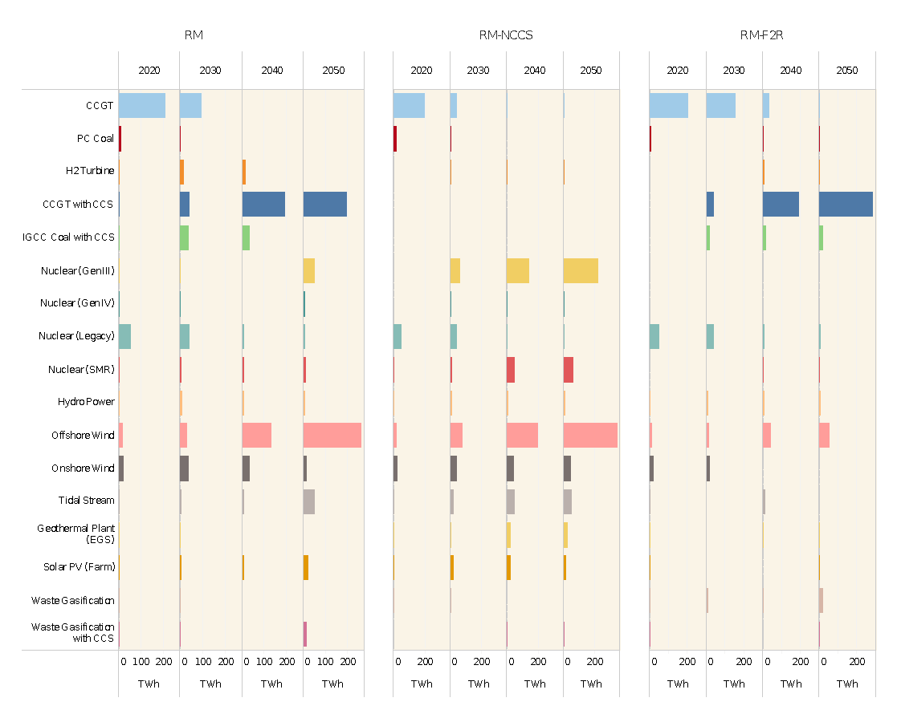

The case study explored a range of uncertainties around future technology cost, performance, deployment
and socio-political feasibility to better understand how different technologies are impacted both by the
deployment of other technologies, and key system wide factors such as carbon price signal, resource
availability etc.

**Message: CCS and bioenergy are expected to play a key role in the evolution of the energy system**

The large scale deployment of CCS drives down the costs of mitigation, both highlighting it as an option that
requires much more consideration in policy. However, its effect on costs also means that it strongly shapes
the take-up of options across the wider system. There is a danger that this influence is hidden in many
analyses and that resulting strategies are not robust to the failure of this technology. Its dominance also
precludes alternatives from receiving the necessary focus, and allows for ‘buying time’ to make the necessary
investment to effect the longer term transition.

Under ambitious climate policy, the value of bioenergy increases. Whilst this usefully identifies the important
role bioenergy can play, there are critical uncertainties concerning future availability, the sustainability of its
use, its impact on ecosystem services and concerns of wider environmental impacts e.g. air quality. A final
crucial insight is that a number of options are more robust to uncertainty in that they typically deploy at scale
under a range of conditions, including offshore wind in the power system, and increased electrification both
in the transport and building sectors. Other technologies remain much more contingent on other factors such
as resource availability (bioenergy, influencing hydrogen use in transport) or technology costs (nuclear
deployment where cost-effective alternatives may not be available).

Such insights, which are applicable to other Member States not just the UK, can help shape future strategy
direction. However, they also give rise to further questions given the inherent uncertainty and the issues that
fall outside of the model boundary e.g. broader sustainability concerns of bioenergy, legal and social
acceptability of negative emissions. What is key is that firm insights can start to shape action now while issues
of greater uncertainty are considered further and subjected to further research.

