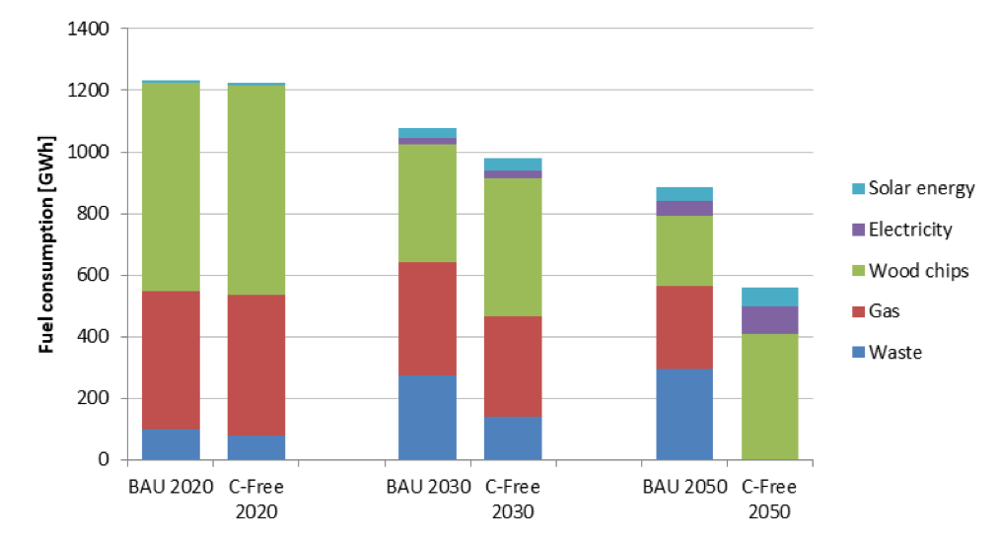
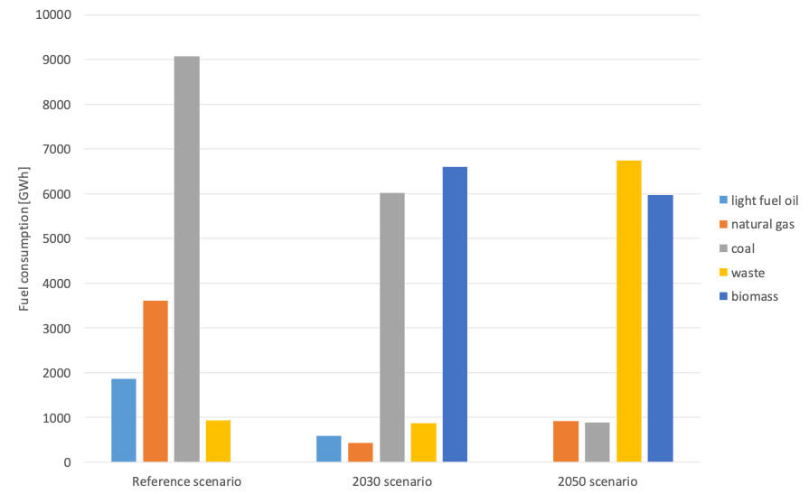
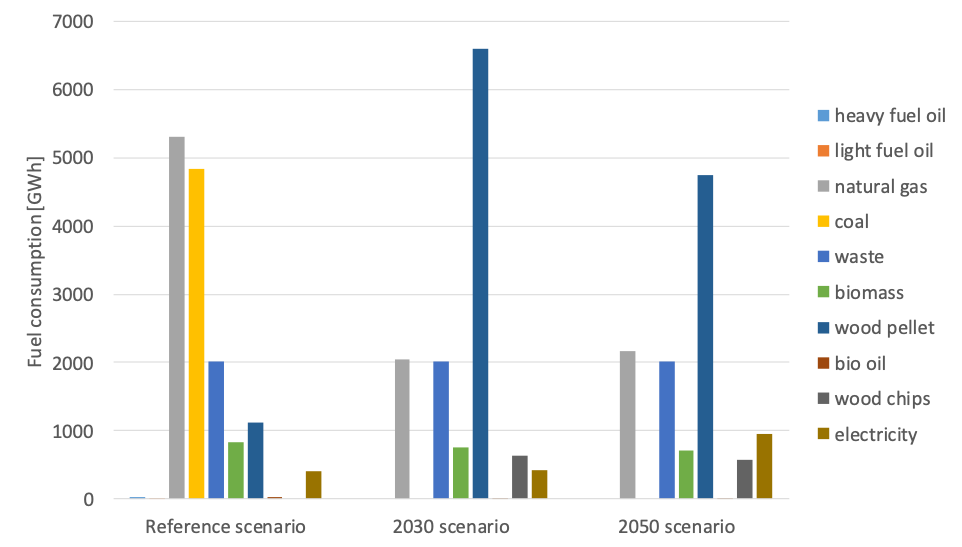

The case study analysed the possibilities of three city regions (Helsinki, Warsaw, and Kaunas) to transform their district heating (DH) systems to achieve carbon neutrality, thereby supporting national strategies towards deep decarbonisation. It employed the energy system modelling tools EnergyPLAN and MESSAGE and scenario analysis combined with interaction with national and city-level stakeholders.

**Message 36: Biomass could have a key role in decarbonising DH in cities.**

The analysis in the case study on district heating showed that in order to reduce emissions, rather large changes are needed in the DH systems. These changes include especially increased use of biomass, waste, heat storages and heat pumps. In addition, the use of CCS technologies could be considered and energy efficiency improved. According to the results of the analysis, heat production in Kaunas could be based solely on wood chips and waste in 2050 (Figure 40). In Warsaw, biomass, waste and electricity could be the main fuels for DH production (Figure 41). The results suggest that in Helsinki region heat and electricity production could mostly be based on wood pellet and waste in 2050 (Figure 42). Increased use of wood, biomass and waste as well as diminished dependence on fossil fuels also contribute to the energy security goals. However, the low availability of these fuels may limit the possibilities to increase their utilisation in DH production in the future. In addition, their price may increase due to the increased demand. This, in combination with the insights from the ecosystems services, as well as the coevolution of technologies case study, is a clear indication that important decisions with regards to the share of biomass in the final energy mix, as well as the use of CCS must be made. On the one hand, those sources/technologies have a significant potential to help decarbonise the system, but at the same time, they are governed by controversy over their deployment and the trade-offs with other sectors.

Figure 40. Fuel consumption in Kaunas DH system in different pathways.

Figure 41. Fuel consumption in Warsaw DH system in different pathways

Figure 42. Fuel and electricity consumption in the DH system of Helsinki region in different pathways.
