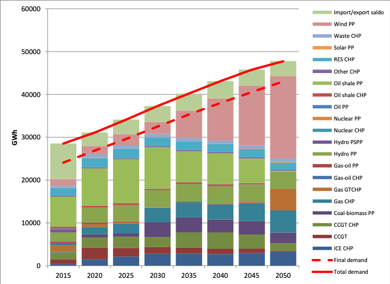

The case study analysed energy security in the Baltic region (Estonia, Latvia, and Lithuania) and Finland in the context of the energy transition. The analysis included modelling various possible disruptions to assess the resistance of the planned energy system to possible threats.

**Message 7: It is crucial for the interconnectors capacity between Baltic countries to be maintained or even extended**

The Baltic States have powerful electrical connections in terms of their capacities and their load (see Figure 12) with neighbouring power systems. The capacity of a separate power line may exceed 30-50% of the country's total power demand. A disruption of the operation of such a line may cause a major disturbance on the entire power system, especially in the case where throughput capacity of interconnectors is reduced. The results of the case study suggest that the number of interconnectors and their throughput capacities, used for electricity trade between countries as well as for providing balancing and reservation services, should be maintained or even extended. This observation could be useful and should be studied further in other Member States as it could, potentially, lead to the expansion of the interconnectors capacity, resulting into overall lower system cost and higher energy security at the same time.

Figure 12. Electricity production by technology type in Baltic States in the case of Base (equivalent to Coalitions for Low-carbon path) scenario.
