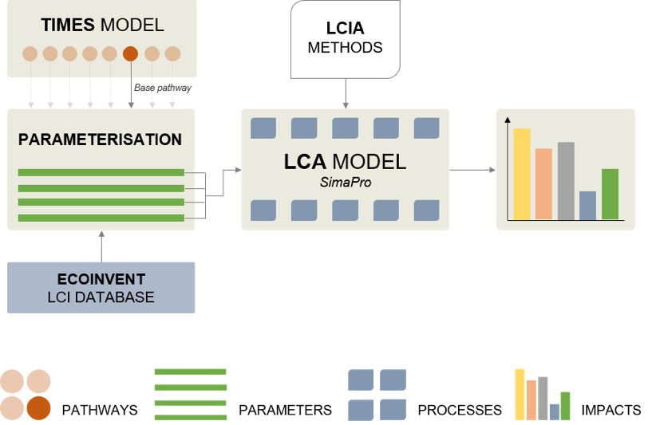
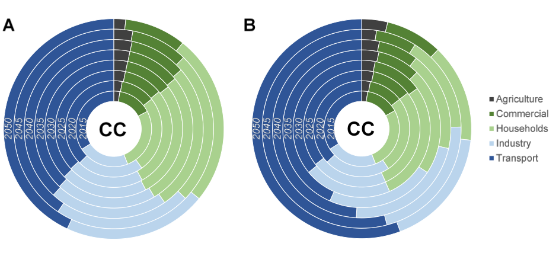
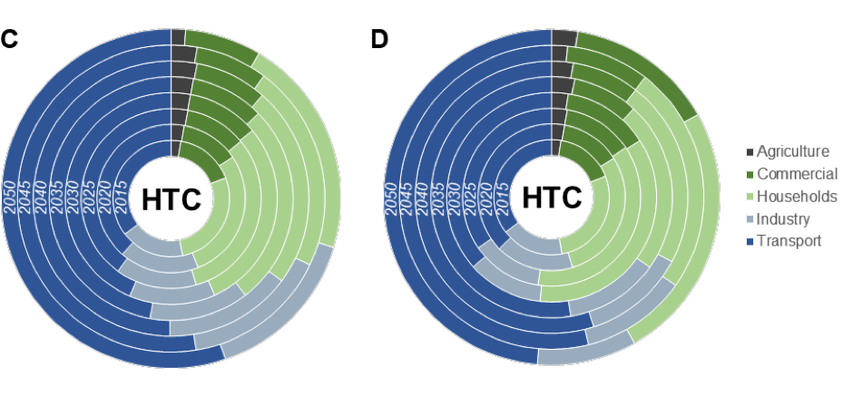
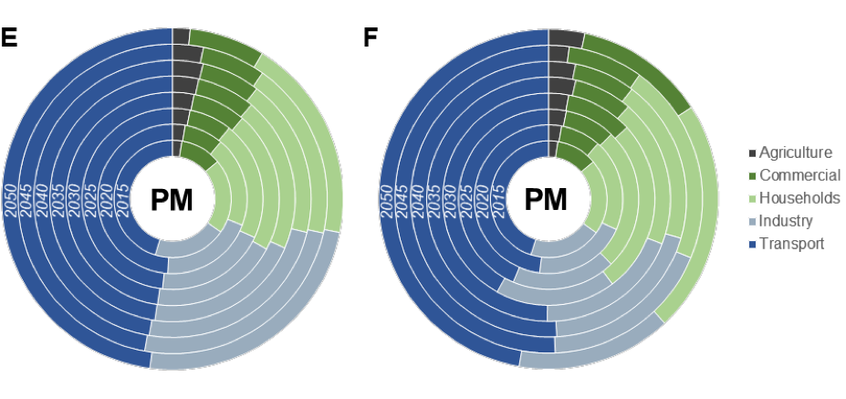
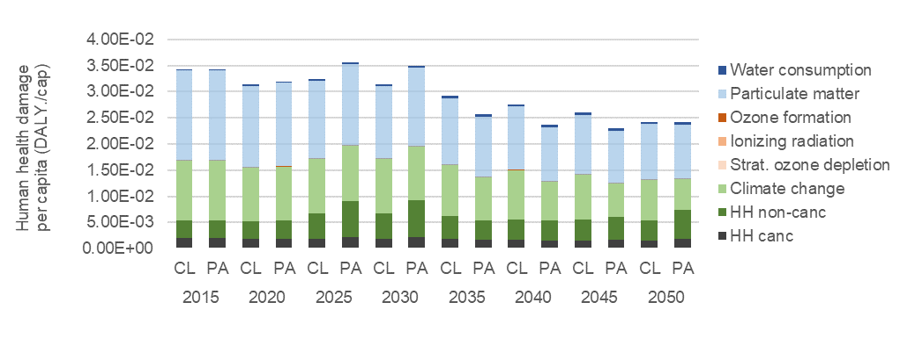

import RenderCharts from '../../src/RenderCharts'
import lca1 from '../../data/lca/lca1'

Energy system investment decisions can significantly impact the environment and the transition to a more environmentally sustainable society. Environment here should be understood in a broad sense, not just addressing climate change impacts from greenhouse gases (which can be reflected by the change in radiative forcing – expressed in kg-CO2eq – or by metrics that model further the cause-effect chain and capture the potential damages to human health and ecosystems)) but other types of environmental problems like chemical pollution, resource depletion, etc. To ensure environmental sustainability, it is important to quantify to what extent the anticipated pathways towards a low-carbon EU society contribute to all those environmental problems, and whether they lead to actual impact reductions.

To conduct such quantification, life cycle assessment (LCA) can be conducted. LCA is an ISO-standardised methodology that enables us to quantify a large variety of environmental impacts in a life cycle perspective, i.e. from extraction of raw materials, through production and use, up to end-of-life and potential recycling or disposal [28]. Thanks to its holistic nature, LCA is widely used to address eco-efficiency questions in comparative studies; for example addressing whether a specific technology is better than another, providing the same service. The inclusion of the full life cycle perspective and the broad variety of environmental problems is essential to identify potential hotspots, which are places in the energy system life cycle that are associated with large environment impacts, and potential burden-shifting across life cycle stages or environmental problems. An example of environmental burden-shifting could occur if a particular strategy leads to decreasing of some environmental impacts (e.g. climate change impacts from greenhouse gases, which can be reflected by the change in radiative forcing (expressed in kg-CO2eq) or by metrics that model further the cause-effect chain and capture the potential damages to human health and ecosystems) while increasing others at the same time (e.g. chemical pollution).

Here, an LCA model has thus been developed to enable the assessment of the entire energy systems of EU with a full life cycle coverage and with a coverage of several environmental impact categories. Three pathways are considered in REEEM: “Coalitions for a Low-carbon path”, “Local Solutions”, and “Paris Agreement”. The first, in this report referred to as the CL pathway, achieves an 80% reduction in energy-related emissions by 2050 as compared to 1990 levels. The second also achieves an 80% reduction, but with a significant fraction of the climate mitigation efforts driven by communities and individuals. The third achieves a 95% reduction corresponding to the obligations agreed upon in the Paris Agreement. It is important to stress that this activity has not considered the Local Solutions pathway, only the CL and PA pathways.

TIMES is an energy system model generator using a bottom-up linear optimisation model, and its outputs are used as inputs for constructing the LCA model that strongly relies on life cycle inventories – see Figure 30. Life cycle inventories (LCI) are building bricks for the model that compiles all inputs (energy, intermediate materials or products, resources) and outputs (energy, waste, emissions, intermediate products) of a given process or activity (e.g. rolled steel production, high-voltage electricity from a specific technology of coal-fired power plant in a given country, etc.). Using the ecoinvent database (v3.3 [30]), which is currently the largest LCI database with more than 20,000 process LCIs, as starting point, the LCA model was built with the addition of 7,275 created or edited processes, which were parameterized and linked to an Excel interface allowing for differentiating between technologies, time and countries, and allow for assessing different pathways (connection via 33,112 links between the LCI processes and the Excel interface).

The LCA model was applied to all energy systems. Only assessment at full EU28 scale was assessed since the TIMES PanEU model in REEEM was developed to fit EU-wide narratives and it therefore does not bring full consistency at national level. For example, some national energy policies are not factored in the TIMES PanEU model, meaning that potential important discrepancies exist between national pathways framed in existing and planned policies and national trends resulting from the TIMES PanEU model.
 

Figure 30. Illustration of the model structure around the LCA model.

## Main insights

**Message 26. Reductions of life cycle impacts on climate change are not aligned with the reduction of GHG emissions from the pathway modelling**

Reductions of climate change impacts (expressed as change in radiative forcing, in kg-CO2 equivalent) of 32% and 49% between 2015 and 2050 are obtained for the CL and PA pathways, respectively (see Figure 31), based on the LCA approach. These decreases are much lower than the reduction of GHG emissions. For example, in the Paris Agreement pathway, a reduction of 95% GHG emissions in 2050 compared to 1990 level is modelled in TIMES PanEU model, which roughly corresponds to a decrease of 93% between 2015 and 2050. This is different from the decrease of 49% obtained with the LCA model. An explanation for such differences may stem from the inclusion of the full life cycle in the LCA study, as opposed to the main focus on greenhouse gas emissions occurring within the EU28 geographical boundaries in the TIMES PanEU model. The climate change impacts of fossil fuel-based energy technologies are driven by the combustion processes, while those of renewables sources like wind turbines or photovoltaics are stemming from their production stage. As a consequence, the switch from fossil fuels to renewables tend to shift the climate change impacts outside the EU28, if renewable energy technologies are produced outside Europe and imported thereafter. This may therefore limit the actual decrease in anticipated greenhouse gas emissions. On the other hand it should be noted that potential reductions of GHG emissions in regions outside Europe are not considered in the LCA model, which may then tend to overestimate the GHG emissions in these regions (because of no time differentiation factoring in the decreases in emission intensities), and lead to underestimate the overall decrease in the global GHG emissions associated with the two pathways. In the PA pathway, decarbonisation in regions outside EU is indeed modelled. An estimate of the true decrease in GHG emissions should therefore be expected to range between the reduction values used in the pathway modelling (in the TIMES PanEU model) and the reduction values reported above.

<RenderCharts config={{lca1}} />

Figure 31. Trends for climate change impacts (per capita) in the EU28 between 2015 and 2050 for both CL and PA pathways.

**Message 27. The transport sector is increasingly driving environmental impacts in the EU28 between 2015 and 2050.**

As illustrated in Figure 32A-F, the transport sector tends to become increasingly dominant in the different environmental impacts between 2015 and 2050 for both CL and PA pathways (in 2050: near or above 50% of climate change impacts, toxicity impacts from released chemical compounds, and health damages from particulate matter). This is a result of the reduction of environmental impacts in the electricity and heating systems (incl. cooling), which transitions to renewables-based energy sources between 2015 and 2050, while transport systems in the CL and PA pathways continue to mainly rely on internal combustion engines with fuels based on biomass and natural gas. However, it should be noted that several road transport processes were created with major assumptions due to lack of data for modelling their emissions; in those cases, conventional technologies were used, which might lead to overestimate the actual emissions from road transportation, and hence tend to amplify the contribution of the transport sectors in the total environmental burden of energy systems.

Yet, the results of this assessment suggest the need for energy policy-makers to focus on this component of the energy systems and ensure transitions to more environmentally-sustainable transport systems. When doing so, a full life cycle perspective and a broad coverage of environmental problems should be included in the assessment to provide reliable support for decision-making. In addition the refining of the modelling to better capture emissions from new technologies for road transportation should be investigated and factored in.

 
Figure 32. Sector distribution for climate change (CC, Figure 32A-B), human toxicity cancer-effects (HTC, Figure 32C-D) and particulate matter (PM, Figure 32E-F)) for the CL pathway and Paris Agreement pathway. Figures on the left refer to Coalitions for a Low-carbon path, figures on the right refer to Paris Agreement.

**Message 28. Human health damages caused globally by energy systems in the EU28 primarily stem from particulate matter formation, climate change and toxic impacts from releases of chemicals**

When assessing the total human health damages, neither the PA nor the CL pathway seem to perform better than the other – see Figure 33. Results show that both pathways lead to the same level of decrease between 2015 and 2050 (i.e. decrease of ca. 30%). However, it must be noted that environmental trade-offs occur, with some environmental impact categories tending to decrease more in one pathway over another, e.g. climate change decreasing more in PA than in CL pathway, and vice versa, e.g. cancer effects from released chemicals aka “human toxicity, cancer effects (HH canc)” (Figure 33). Particulate matter formation, climate change and toxicity of chemical releases are found to be the three main contributors to human health damages from energy systems in the EU28. These impacts are caused by emissions of particulate matter (and its precursors, like SOx, NOx, NH3), greenhouse gases and metal and organic substances.

It can be observed that the total damages from the LCA study are equivalent to approx. 17 million DALYs in 2015 and decrease to 12 million DALYs in 2050 for both CL and PA pathways (Figure 33), although as noted in the previous messages, overestimations are expected in these estimates, particularly in future years due to the modelling of regions outside Europe using the same technology efficiencies – and hence emission intensities – as today (no time differentiation). Yet, factoring in this overestimation, the obtained results would still remain higher than the results reported when using the EcoSense model, where approximately 2.8, 2.0 and 1.9 million DALY were found to stem from the energy systems in the EU28 in 2015 for both pathways, in 2050 for the CL and in 2050 for the PA pathway.

The different scoping between the two assessments explain part of this difference since the EcoSense model focuses on the emissions during the operation stage of the energy system, while the LCA study includes the entire life cycle of the energy systems, from extraction of raw materials through production and installation and operations up to end-of-life. For example, the impacts associated with production of goods in China which are then imported to Europe will be captured. The difference in impact contributors to the total human health damages is another cause for the difference. The assessment from the EcoSense model considers emissions of few air pollutants, while the LCA study encompasses all environmental stressors contributing to human health damages, hence including contributions from climate change, water stress and carcinogenic and non-carcinogenic effects induced by chemical releases like metals and organic substances.

These findings demonstrate that, in addition to a systemic and holistic perspective, including all life cycle stages (and not just the operations within the EU), a broad spectrum of environmental problems, covering all relevant impacts of energy systems, must be included in environmental sustainability assessments. Only such broad and all-encompassing scoping can provide a complete overview of which environmental problems are predominant in the total environmental burden, where potential environmental trade-offs occur, where burden shifting from one life cycle stage to another or from one impact to another arise, and what to prioritize in decision-making processes.

 
Figure 33. Total human health damage assessment results in the EU28 over 2015-2050 for both Coalitions for a Low-carbon path and Paris Agreement pathways, with contribution of different environmental impact categories.
