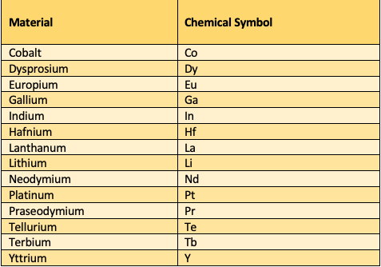
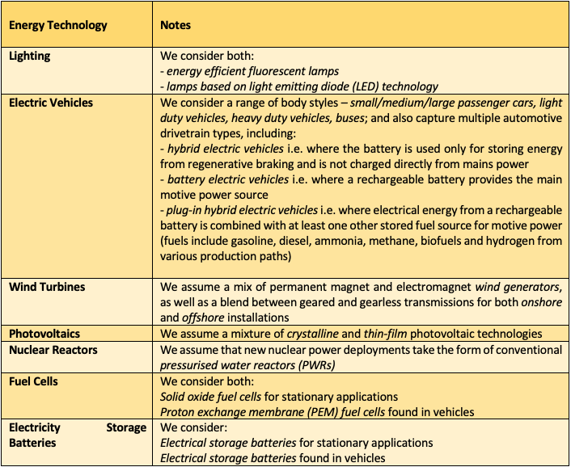
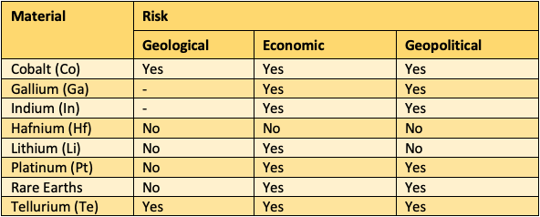
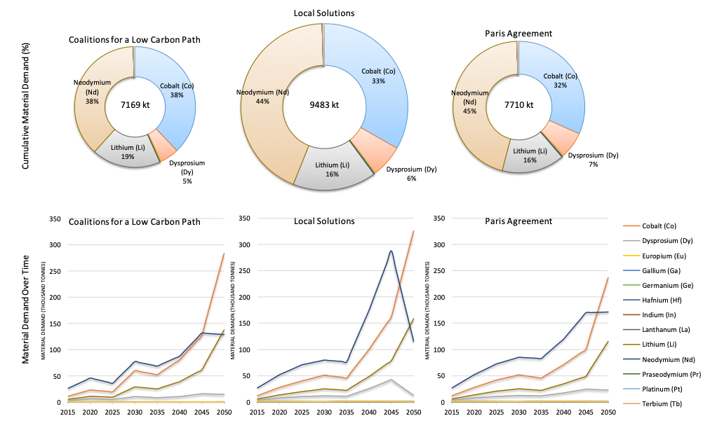

import RenderCharts from '../../src/RenderCharts'
import criticalmaterials1 from '../../data/criticalmaterials/criticalmaterials1'

The critical materials assessment component of Task 5.3 in REEEM covers 14 raw materials and 7 energy technologies that require these materials, exploring how European energy technology related demands for these materials might change between the three different pathways explored in REEEM under Work Package 1. Moreover, the risk of supply bottlenecks that might impede these technological transitions in future are also assessed. Table 6 and Table 7 below show the materials and the energy technologies considered in this activity.

 
Table 6. Materials considered in this report.

 
Table 7. Clean energy technologies considered in this report.

Wind Turbines	We assume a mix of permanent magnet and electromagnet wind generators, as well as a blend between geared and gearless transmissions for both onshore and offshore installations
Photovoltaics	We assume a mixture of crystalline and thin-film photovoltaic technologies
Nuclear Reactors	We assume that new nuclear power deployments take the form of conventional pressurised water reactors (PWRs)
Fuel Cells	We consider both:
Solid oxide fuel cells for stationary applications
Proton exchange membrane (PEM) fuel cells found in vehicles
Electricity Storage Batteries	We consider:
Electrical storage batteries for stationary applications
Electrical storage batteries found in vehicles

## Main insights

**Message 29. Material demands are dominated by vehicle technologies**

Figure 34 illustrates a breakdown of material demand for each pathway by energy technology. From this chart the major drivers behind the demand for materials can be seen clearly. In all three pathways, electric vehicles and plug-in hybrid electric vehicles are the major sources of material demand. This renders the automobile sector (which is expected to play an important role in the transition) susceptible to various types of risk which need to be taken into account when designing a strategy.

<RenderCharts config={{criticalmaterials1}} />

Figure 34. Cumulative material demand by technology.

### Variations by pathway:

LS and PA feature a significantly higher share of demand attributed to hybrid electric cars than the CL pathway (where shares are almost equal). Overall, the demand for critical materials by the vehicle sector is increased in the LS pathway compared to the other two.

**Message 30. A number of potential supply bottlenecks exist across the geological, economic and geopolitical dimensions. The most at risk materials appear to be cobalt and tellurium, with a second grouping being platinum, rare earths (particularly dysprosium and neodymium), gallium, and indium.**

Table 8 summarises the supply risks for each of the selected materials. Cobalt and tellurium appear to be at risk across all three assessed dimensions. Platinum and the rare earths are not at risk from a geological perspective but are exposed to economic risks due to rapid demand growth and geopolitical risks as a result of high supply concentrations in single countries. Gallium and indium are also clearly exposed to economic and geopolitical risks but the overall geological risk level could not be determined due to a lack of quantitative data on reserves. Lithium is at risk from the economic dimension but is not likely to be affected by geological constraints or geopolitical crises. Finally, hafnium does not appear to be at risk in any of the assessed dimensions.

 
Table 8. Overview of Supply Risks for Selected Materials.

### Variations by pathway:

Figure 35 illustrates results for each of the REEEM pathways, both the shares of cumulative material demand across the modelled time horizon and the detailed of how material demand changes over time for individual elements. Both the CL and the PA pathways represent similar levels of material demand at 7169 kt and 7710 kt respectively. The LS pathway has the highest material demand of all at 9483 kt, likely owing to the significantly larger role that a transition to low-carbon end-use demand technologies has in this case.

 
Figure 35. Material Demand for Each REEEM pathway.

**Message 31. Key mitigation options for the EU are material efficiency, recycling and substitution , which should be considered as policy imperatives**

A large fraction of the critical material demand assessed in this report arises from the transition to electro-mobility, so per unit estimates of material demand for vehicles are a key driver of the report findings. It is worth reflecting that research into material efficiency and component substation has found that rare earth content in vehicle magnets could be reduced through efficient design by up to 40% and that options for electric motors are under development that are free of rare earths entirely. This is a pathway independent message.
