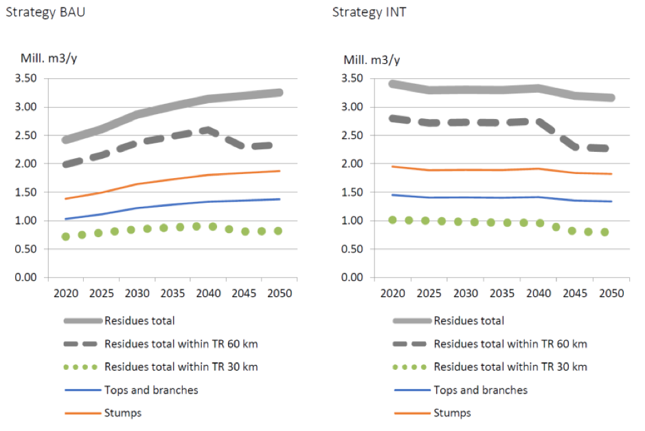

Focused on Lithuania, it assessed impacts of alternative forest management strategies on multiple ecosystem services (i.e. industrial wood, bioenergy, carbon storage, recreation and habitat). The case study also developed and discussed linking between an ecosystem service assessment tool (LEcA tool) and an energy systems model (MESSAGE) in order to integrate ecosystem services in sustainability assessment of energy policy and related forest bioenergy options.

**Message 35: Forest management strategies could ensure desired level of ecosystem services while supporting fulfilment of national decarbonisation targets**

Substantial focus should be given to developing management strategies that keep the desired level of ecosystem services while supporting fulfilment of national decarbonisation targets. The same level of biomass supply can often be obtained using a multitude of different forest management configurations, both with regards to the character of activities and their geographic allocation. Figure 39 illustrates that when increasing the yields above a certain threshold, the resources may be exhausted in the long run. At the same time, ecosystem services such as carbon storage, recreation and habitat supporting biodiversity may also be affected. Forest management strategy is a crucial linkage between forest biomass extraction and other ecosystem services. This could be particularly useful, as the energy systems optimisation in REEEM suggests that a significant share of biomass will be included in the energy mix. Thus, before allocating resources for bioenergy, judicious planning is critical in order to ensure the well-being of other services.

Figure 39. The extraction of logging residues with and without transport restrictions, for the forest management strategies BAU and INT
