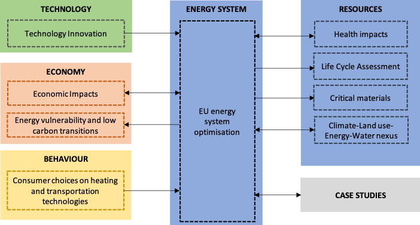

This section gives a brief description of the modelling activities and other types of analysis that contributed to the impact assessment on the Pan EU scale, investigating the REEEM pathways described in Section 2. Moreover, it is explained how those activities link to each other in order to create the REEEM integrated framework. Each description is followed by the main messages that emerge from the relevant activity, accompanied by supporting graphs and charts that point out the indicators selected. The modelling activities are the following:

*	Energy system optimisation
*	Economic impacts
*	Health & Environmental impacts
*	Energy vulnerability and low carbon transitions
*	Life Cycle Assessment (LCA)
*	Critical materials
*	Water-Climate-Energy-Land use nexus

On top of that, two other types of analysis have been considered. It has to be noted these activities are pathway independent:

*	Behavioural analysis
*	Technology analysis

Although the sub-national case studies are not part of the integrated framework to analyse impacts on Pan-European level, they have been considered in the data harmonisation process. Between all the aforementioned activities, there is some exchange of data with other activities. The data exchange can fall under the following 4 categories:

1.	Two activities have some common input and thus, they align the relevant values.
2.	One activity takes some input data which is an output of another.
3.	One activity takes some input data which is an output of another, but the latter also takes some input data which is an output of the former.
4.	Same as in case 3 but for a number of iterations until the 2 activities reach convergence in certain values.

The following diagram depicts the exchange of data between all the aforementioned activities, while the exact data exchanges are described in the subsequent sub-sections.

