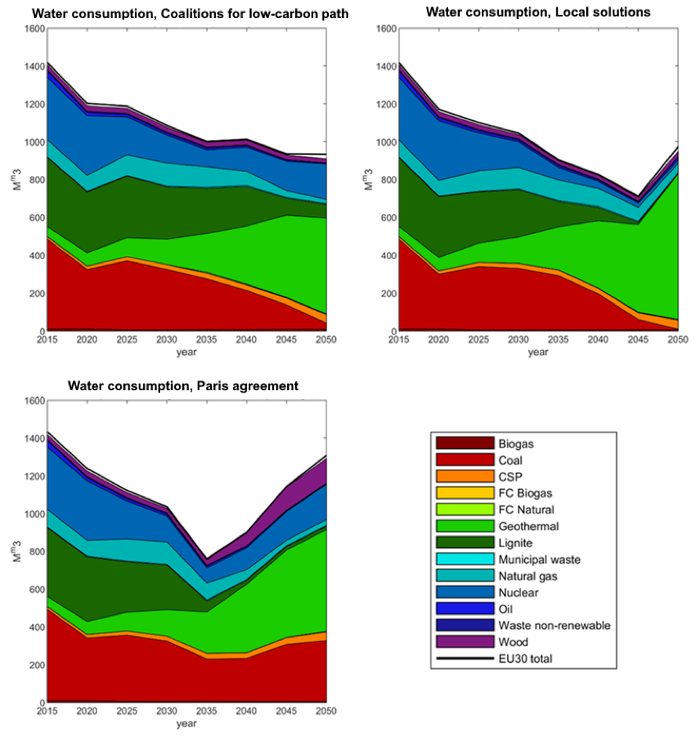
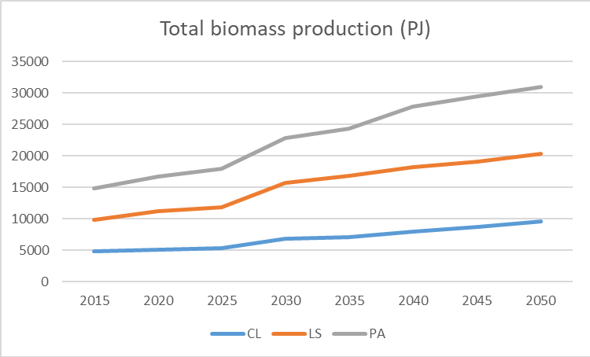
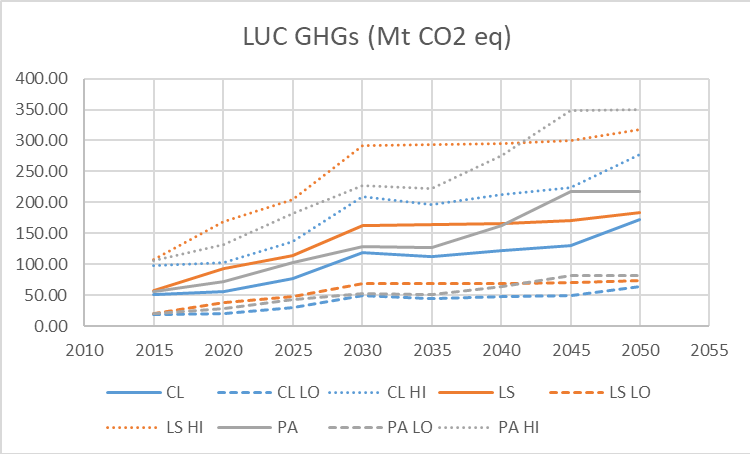
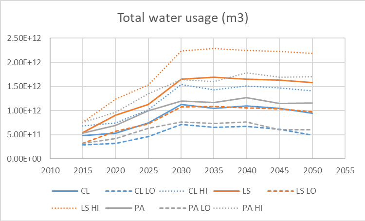
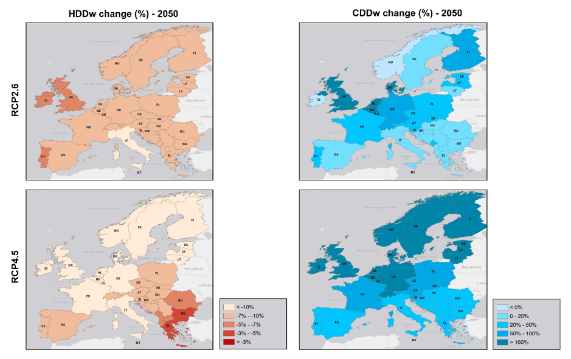

import RenderCharts from '../../src/RenderCharts'
import waternexus1 from '../../data/7_waternexus/waternexus1'

Deep changes in the way energy is supplied and consumed, as those advised in the Clean Planet for all strategy and in SDG7, combined with climate changes, are likely to affect and be affected by changes in other related systems. Two of these are water and land resources. Part of the integrated assessment of REEEM focused on analysing selected interactions between the energy, water, land and climate sector (with a so-called Nexus approach) under the transformations assumed in the REEEM pathways. For this task, REEEM employed a vast range of existing external data sources, which have been processed, or modelled. To complete the modelling, part of the input data was taken from the output data-set of TIMES PanEU. The data exchange pertains mainly to energy generation and capacity of relevant units across the EU. The selected interactions REEEM analysed within the scope of this part of the assessment are:

•	Water Use in Electricity Generation for Water-Energy Nexus Analyses;

•	Future changes in heating and cooling demands over Europe as the effect of a changing climate;

•	Land use changes in relation to changes in the energy system.

The rationale for the linkage between water and energy is the tight link between these two components: a substantial share of the global water usage is due to the energy sector, with high impact on water resources. In REEEM we address the current basis for a performing quantitative analyses on the water-energy nexus also with regards to data availability and quality. We then address and validate the quality of literature estimates on water factors (water used per energy unit produced) on historical timescales as well as projecting these for the future using under the REEEM pathways. Further, we address the impact of increasing temperatures under climate change scenarios on energy demands in the EU, by calculating the future changes in heating and cooling demands. This study is meant to highlight the importance – especially under climate change - of environmental drivers of energy demand, besides economic and demographic drivers. Finally, we calculate the interlinkages between changes in land use and changes in the energy system especially with regards to the use of biomass for energy supply. As the decarbonisation may require more biomass in industry and power generation (as resulting from the energy system optimisation study), its impacts on EU, national and sub-national scale need to be assessed.

The activities to study the aforementioned interactions can be categorised into the following five components:

1.	Water Use in Electricity Generation for Water-Energy Nexus Analyses: The European Case
This study assesses the historical water usage (withdrawals and consumption) of all major relevant electricity generation sources and sub-technologies based on an extensive literature review and validates its results against available country-level data on actual withdrawals [31].

2.	Future risks of water shortage at the European scale: Energy sector water usage and projected scarcities.
This study employs the methodology developed in [32] paper on water usage factors (water volume per. Electricity unit generated) in conjunction with all three REEEM pathways to estimate the future electricity generation water usage (until 2050). These estimates are then analysed in conjunction with data on future precipitation, net precipitation (precipitation minus actual evapotranspiration) and temperature to address areas of potential scarcities and competing demands. Since the study employs every available modelling output (up to approx. 18 models per RCP scenario) from the high-resolution (12.5km) CORDEX database [33], estimates on the robustness and variability is also incorporated.

3.	Future changes in heating and cooling demands over Europe
This study assesses the future heating and cooling demand based on a degree-day methodology and state-of-the-art CORDEX regional climate model ensemble data from the RCP scenarios 2.6 (for the Paris Agreement pathway) and 4.5 (for the Coalitions for a Low-carbon path and Local Solutions pathway) up until 2050.

4.	Challenges of Data Availability: Analysing the Water-Energy Nexus in Electricity Generation
This study aims to discuss and demonstrate the challenges of data availability and quality in the assessment of research questions within the water-energy nexus. A broad range of datasets are presented from the water, climate and energy communities respectively and examples on the usage of these datasets are further highlighted.

5.	Land use changes in relation to REEEM energy pathways
The REEEM pathways are used to show the necessary changes in land use as mainly related to biofuels.

The complete description and the output of the aforementioned activities can be found in deliverable D5.1 - [Focus Report on climate impacts on the Energy-Food-Water nexus](http://www.reeem.org/index.php/deliverables-by-theme/).

## Main insights

**Message 32: More ambitious decarbonisation targets can lead to higher water consumption**

Energy system is a major consumer of water as mostly used in the cooling of thermal power plants, but also other uses such as cleaning. Energy system transitions will influence water usage levels, while climate change will have an influence on its availability. The assessment of water consumption until 2050 shows decreasing water consumption mostly resulting from phasing out of fossil fuel thermal plants (Figure 36). At the same time, higher utilisation of geothermal (along with the high water intensity of this technology) in response to more ambitious decarbonisation targets leads to an increase in water consumption.

Figure 36. Water consumption for electricity generation in CL, LS, and PA pathways for the EU28 (all energy sources) and EU30 (total).

### Variation by pathway

On a EU28+2 level, the total water consumption from electricity generation (Figure 36) is decreasing from 2015 towards 2050 for the CL pathway and to some extent the LS pathway, whereas in the PA pathway it decreases towards 2035 where after an increase to approximately 2015 levels is seen in 2050. The main sources for the decreasing levels is seen for the traditional non-renewable energy sources such as coal, lignite, natural gas and to some extent nuclear. The main water consuming energy sources after the implementation of renewables is geothermal energy – for all pathways a vast increase in geothermal water consumption is seen, especially for LS. The main reason for the increase in total water consumption in the PA pathway is a smaller reduction in coal-, and to some extent nuclear-, water consumption as compared to the CL and LS pathways.

**Message 33: To unlock the full potential of using biomass for energy production, further development and exploitation of second or higher generation biofuels are key. Continued harvesting of biomass from vegetable oils, starch and sugar crops may be necessary along the way**

Biomass is projected to play an important role in an energy system with an increasing share of renewables. While often assumed to be carbon neutral, some forms of biomass production for energy purposes may arguably be associated with substantial emissions, including the growing of wood crops. For example first generation biofuels produced from food crops such as wheat and maize or from vegetable oils extracted from, e.g., rape seed or soy beans, may incur considerable associated emissions and lead to increased water stresses locally. In contrast, second or higher generation biofuels based on crop or wood residues will optimize the potential of introducing biomass into the energy system in terms of both climate change mitigation and water usage.
 
<RenderCharts config={{waternexus1}} />

Figure 37. Projected biomass production [PJ] by pathway and the associated land use change emissions and water usage. In the case of biomass-induced GHG emissions due to land use change, full lines indicate a median estimate whereas (LO, HI) indicates estimates calculated using conversion factors corresponding to the 25th and 75th percentiles, i.e., providing an estimate of the uncertainty. For total water usage the corresponding values correspond to the mean estimate and (-/+) one standard deviation.

### Variations by pathway
In the LS pathway, bioenergy (Figure 37, top panel) is initially harvested mainly from vegetable oil (rape seed) and other potential sources like residues that are converted into second- or higher generation biofuels; the role of starch crops and woody crops is small. Until 2030, the use of rape seed and other bioenergy sources is growing dramatically, leading to increased emissions (Figure 37, middle panel) and water usage (Figure 37, bottom panel); after that the use of oils declines slightly, while the exploitation of the latter continues to climb. The contribution of starch crops decline further, whereas the role of woody crops increases moderately, leading to sustained high water usage and land use change emissions; however, they play only smaller roles compared to the other two. The high water usage of woody crops though is mainly associated with “green water” and not in terms of actual irrigation.

In the CL and PA pathways, which emerges as the more sustainable ones, considering water usage and emissions induced by biomass production, the role of advanced biofuels are projected in a similar way and the use of woody crops is more significant, in particular in PA. As in the LS pathway, rape seed is initially an increasingly important component of the energy mix, but here it is quickly phased out of the system after 2030.

Dashed and dotted lines indicate a low, respectively, high estimate of the biomass-induced GHG emissions due to land use change and total water usage and shows the abovementioned results to be robust.

**Message 34: Heating demands decrease throughout EU - the opposite is seen for cooling demands**

In T5.1, the effects of future temperature changes on space heating and cooling demands in European buildings were analysed. The analysis was performed for two low-to-medium GHG emission climate scenarios and eight regional climate models. By utilising minimum, maximum and mean daily temperatures in five-year steps between 2010 and 2050 to calculate heating and cooling degree days (HDDs and CDDs), both absolute and relative climate changes were explicitly accounted for. HDDs and CDDs were subsequently utilised to scale up/down the projected space heating and cooling demands in buildings, while population density was employed as proxy for the spatial distribution of the demands to obtain the national space heating and cooling demands.

Figure 38 presents the country-level relative changes in HDDs and CDDs for scenarios RCP2.6 and RCP4.5 between the years 2010 to 2050. Heating demand generally decreases throughout the EU. Almost all countries in northern and western Europe have a higher decrease in HDD for RCP4.5 (>10% decrease) than for RCP2.6 (5-10% decrease). Also, Greece and Bulgaria experience only a <3% decrease in RCP4.5 compared 7-10% decrease levels for RCP2.6. For cooling demand, the opposite is true – it increases throughout the EU. The largest increase in cooling demand is seen for RCP4.5 especially for the Northern parts of Europe including UK, Germany and the Baltic countries (>100%).

Figure 38. Country level relative changes in weighted heating and cooling degree days (HDDw and CDDw) from 2010 to 2050 for the RCP2.6 and RCP4.5 climate scenarios respectively.
