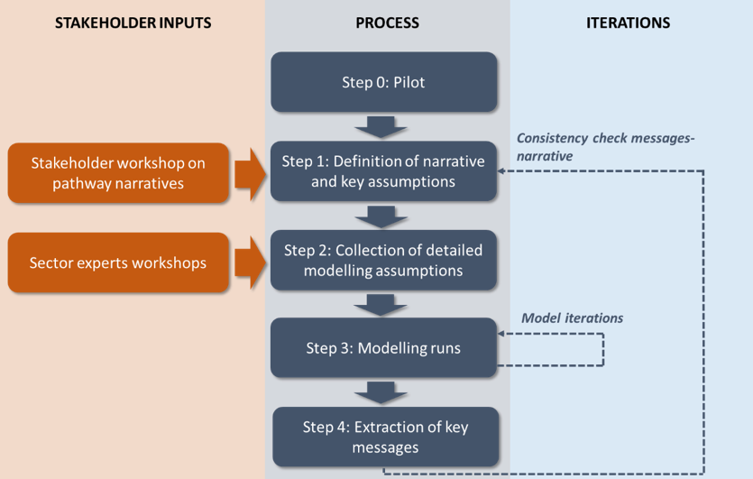

The steps of the process are shown in Figure 2 and described below. Under each step, indication is given about which of the above characteristics it mostly contributes to, highlighted in brackets and bold characters. Step 3 includes a large number of activities, which are subsequently described in detail in Section 3.

Figure 2. Pathway construction process in REEEM

*	**Step 0: Pilot**: This is a simple, yet informative first-attempt analysis on the trade-offs between opposite energy policy decisions (centralized vs national) leading to the same reduction in GHG emissions. Two cases were analysed in this experiment:
    *	Pilot 1 – The EU acts as an Energy Union, where one unique target of 80% GHG emission reduction in 2050 compared to 1990 is imposed and this is shared by the Member States;
    *	Pilot 2 – Each Member State imposes its own 80% GHG emission reduction target in 2050 compared to 1990 independently.

  Only a limited number of the REEEM modelling tools were used to analyse these two cases. They were calibrated with input data available to modelling teams prior to the project and not necessarily harmonised between teams. The modelling results highlight the cost effectiveness of centralised decisions (i.e. at EU level), with burden sharing based on the marginal abatement costs of Member States. In addition, the pilot allowed the consortium to identify 1) what aspects of the transition may need more investigation among the many aspects that could be undertaken within the scope of the project, 2) which models to use for which part of the assessment, 3) how to link them and 4) according to which time plan. **[Development of the analytic framework]**

*	**Step 1: Definition of narrative and key assumptions**: This relies on stakeholder inputs on what matters in the energy transition and what questions need investigating. For this reason, a mixed group of stakeholders were invited to a workshop, including representatives from industry, research institutions and policy makers. The outcome was two storylines and a collection of key assumptions for each, representing the first draft of the pathways Coalitions for a Low-carbon path and Local Solutions. **[Co-designed, comprehensive and coherent]**

*	**Step 2: Collection of detailed modelling assumptions**: The key assumptions defined in the previous step provide a general direction for the analysis, but they are not enough for setting up runs of all the REEEM models. The knowledge of modellers is imperative, as they have to turn the story defined in the previous step into consistent detailed numerical figures. In addition, another round of involvement of sector experts and stakeholders is needed to help define specific numerical inputs. Several stakeholder workshops and interviews of experts were carried out to collect such inputs for models performing different sectoral and regional analyses. [Co-designed, comprehensive and coherent]

*	**Step 3: Modelling runs**: These are carried out with the modelling tools and according to the methodologies described in Section 3. At this step, comparison between energy and economic models happen, to ensure they use consistent inputs and provide consistent outputs to enable integration. **[Coherent]**

*	**Step 4: Extraction of key messages**: From the outputs of all the model runs in the previous step, key messages are extracted on the impacts of transitions to a low-carbon EU energy system and the role of technologies. Though consistency in the model inputs was ensured in the previous steps, the models still have a large solution space and the indicators they provide as output may not be completely in line with the storyline assumed in Step 1. If this is the case, the process is iterated: the narrative and the key assumptions are adjusted (Step 1) and all the following steps are carried out consequently. If for instance, the storyline foresees a certain share of EVs which does not materialise in the first run, the model is calibrated accordingly (using a number of assumptions) in order to achieve this share. **[Coherent]**
