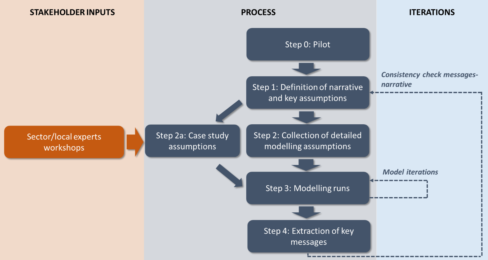

The pathways described in the previous subsections are analysed with a suite of tools capable of investigating the economic, environmental and social impacts of decarbonisation in the EU and in each Member State, the insights from which are described in Section 3. However, EU-wide and national scale analyses may not capture challenges and opportunities experienced in the decarbonisation process within specific localities or regions. For this reason, the set of pathways defined above are also applied in five sector- and region-specific case studies.

These REEEM case studies analyse impacts of deep decarbonisation pathways in selected geographical areas and with focus on specific challenges. All of the case studies have either national (single Member State), trans-national (several Member States) or sub-national focus, but address issues that have broader relevance and are applicable outside of their geographical scope. In other words, they provide important insights into issues that are worth examining in the whole EU. The areas of interest of the five case studies are:

*	Ecosystem services (Lithuania);
*	Coevolution and competition of technologies in a low-carbon system (United Kingdom);
*	District heating (Helsinki, Warsaw and Kaunas);
*	Regional energy security (Baltic region and Finland);
*	Grid and dispatch (South-Eastern Europe).

Given their specific focus, the input assumptions of the case studies need to be much more spatially resolved than those of the Pan European studies described so far. To give an example, in TIMES PanEU assumptions are made about policies and technology options for the decarbonisation of Poland, Finland and Lithuania on a **national scale**. However, no information is given on policies and availability of technologies **on a city scale**. The range of policy options and available technologies for cities which may comply with the national plans represented in TIMES PanEU is very large. Therefore, further assumptions are needed in the case study analysing district heating options in Helsinki, Warsaw and Kaunas, which cannot be taken from TIMES PanEU. Such assumptions are made by modellers in the REEEM Consortium based in the analysed areas, with inputs from sector/local experts through dedicated workshops. The process happens in parallel with the one of definition of the three REEEM pathways, as depicted in Figure 3.

Figure 3 Process of case study definition

Consistency with the assumptions of the PanEU studies presented in the previous sections is ensured by carrying out a process of harmonisation between TIMES PanEU and the models used for the case studies for all input assumptions which are common. All the other assumptions made by the modellers and by the experts are made so as to comply with the qualitative EU-scale narrative presented in Section 2.4. Therefore, each case study analyses a **wide range of sensitivities** around the main trends depicted in the three REEEM pathways. The choice of such sensitivities depends on the specific challenges analysed in each case study. The sensitivities are named differently in each case study.

